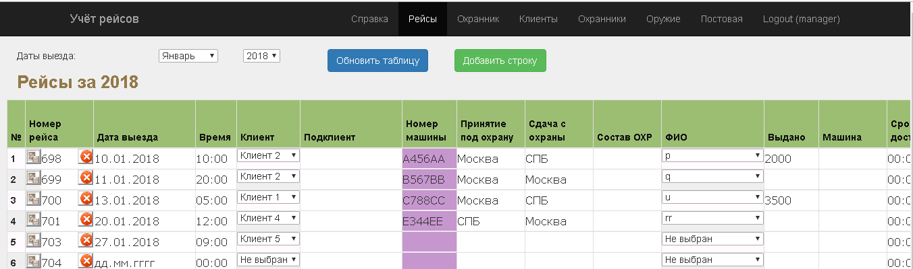
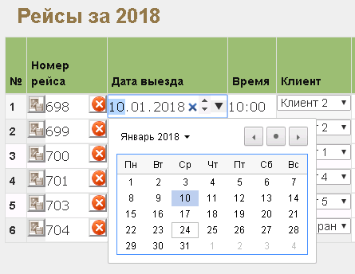
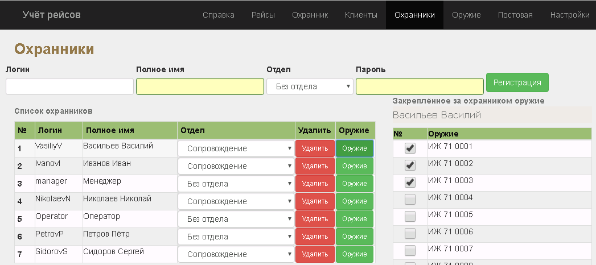
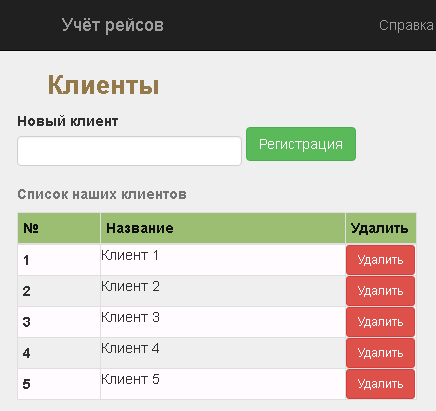
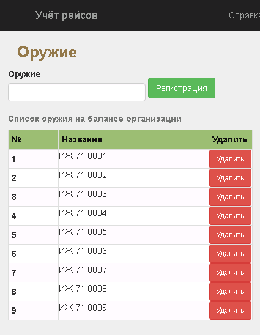
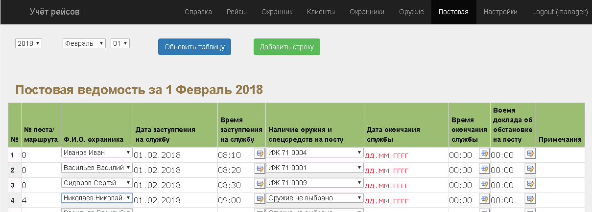

## Описание
Сервис для частного охранного предприятия, позволяющий вести контроль и учёт рейсов охранников с охраняемым грузом. Менеджер заносит в базу рейсы (заказчик, время отправления, стоимость и т.д.) и распределяет, кому из охранников какой рейс достанется. После завершения рейса автоматически подсчитывается его цена, с учётом возможного простоя и неустоек. Охранник же со своей стороны (используя любой смартфон) фиксирует номер автомашины, реальные время отправления и завершения рейса, а так же делает и отправляет фотографии (экипажа и пломб). 

## Для чего это
Сервис сделан ради улучшения контроля за охраной грузов фирмой, осуществляющей услуги по охране. До его внедрения охранники перед выездом инструктировались устно, а при отправлении и по завершении рейса отзванивались дежурному, который вносил информацию в табель рейсов вручную. На основе этого табеля, менеджер в экселе рассчитывал сроки доставки, неустойки и прочие финансы. Фиксация пломб на кузовах автотранспорта велась так же вручную. Сервис позволил автоматизировать эту работу. Кроме того, здесь есть отдельная страница для учёта табельного оружия и прочих спецсредств, выдаваемых охранникам. В таблице видны все охранники, получившие на текущий момент оружие и не сдавшие его. Можно просмотреть этот список за любую дату.

## Скриншоты
Интерфейс менеджера  

Изменение даты рейса  

Список охранников  

Список фирм клиентов  

Список зарегистрированного оружия  

Постовая ведомость  

Галерея фотографий с рейса  

Интерфейс охранника (выбор дня, на котором есть рейсы)  
